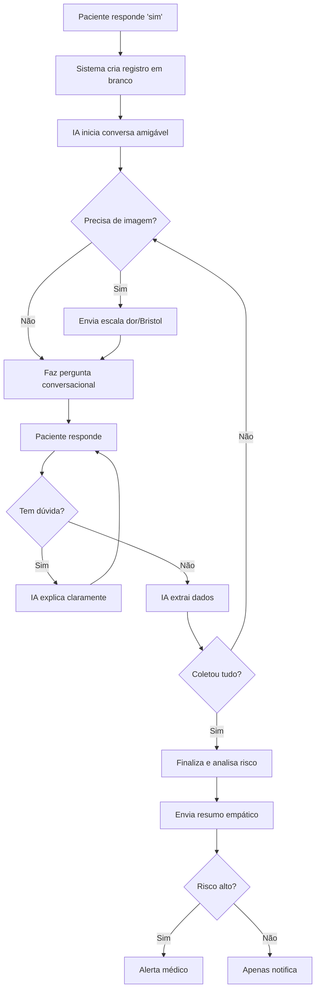

# Integração Claude AI - Questionário Conversacional

## O QUE FOI IMPLEMENTADO

O sistema de questionário pós-operatório foi **completamente reescrito** para usar IA conversacional (Claude API da Anthropic) ao invés de perguntas sequenciais burras.

## PRINCIPAIS MUDANÇAS

### 1. **Conversa Natural com Claude**

**ANTES:**
```
Bot: Como está sua DOR hoje? (número de 0 a 10)
Paciente: 5
Bot: Você está com FEBRE? (sim ou não)
Paciente: não
[...continua mecanicamente...]
```

**DEPOIS:**
```
Paciente: sim
Bot: Olá Maria! Vou fazer algumas perguntas sobre sua recuperação.
     Vou enviar uma escala de dor para você avaliar melhor.
[Envia imagem da escala]
Bot: Como está sua dor hoje? Use a escala que acabei de enviar.
Paciente: tá uns 6
Bot: Entendo, dor moderada. E febre, tem sentido?
Paciente: o que é febre exatamente?
Bot: Febre é quando a temperatura fica acima de 37.8°C. Você está sentindo calor, suor ou mediu a temperatura?
Paciente: ah não, tô normal
Bot: Ótimo! E está conseguindo urinar normalmente?
[...continua conversando naturalmente...]
```

### 2. **Responde Dúvidas do Paciente**

O Claude agora **entende** e **responde** perguntas como:
- "O que é sangramento leve?"
- "Como sei se tenho febre?"
- "O que significa escala Bristol?"
- "É normal sentir dor?"

### 3. **Envia Imagens Médicas Automaticamente**

Quando a IA detecta que precisa coletar informações sobre:
- **Dor** → Envia escala visual de dor (0-10) ANTES de perguntar
- **Evacuação** → Envia escala Bristol (tipos 1-7) ANTES de perguntar

### 4. **Extração Inteligente de Dados**

A IA extrai informações estruturadas de respostas naturais:

```typescript
// Paciente diz: "tá doendo bastante, uns 7 ou 8"
// IA extrai:
{
  painLevel: 7,
  // ...
}

// Paciente diz: "tive um pouquinho de sangramento, só mancha"
// IA extrai:
{
  bleeding: "mild",
  bleedingDetails: "apenas manchas"
}
```

### 5. **NÃO Reinicia Questionário**

Se o paciente já completou o questionário e manda outra mensagem:
- Sistema **NÃO** reinicia tudo
- Responde contextualmente: "Você já completou o questionário de hoje..."

## ESTRUTURA DO CÓDIGO

### Arquivos Modificados

**`app/api/whatsapp/webhook/route.ts`** (principal)
- `processQuestionnaireAnswer()` - Nova função com IA
- `callClaudeAPI()` - Chama Anthropic API
- `sendImageScale()` - Envia imagens médicas
- `finalizeQuestionnaireWithAI()` - Finaliza e analisa

**`lib/whatsapp.ts`** (já existia)
- `sendImage()` - Função para enviar imagens

**`lib/anthropic.ts`** (já existia)
- Cliente Anthropic configurado
- `analyzeFollowUpResponse()` - Análise de risco

## DADOS COLETADOS

```typescript
interface PostOpData {
  // 1. DOR (escala 0-10)
  painLevel?: number;

  // 2. FEBRE
  hasFever?: boolean;
  feverDetails?: string;

  // 3. URINA
  canUrinate?: boolean;
  urinationDetails?: string;

  // 4. EVACUAÇÃO
  hadBowelMovement?: boolean;
  bristolScale?: number; // 1-7

  // 5. SANGRAMENTO
  bleeding?: 'none' | 'mild' | 'moderate' | 'severe';
  bleedingDetails?: string;

  // 6. ALIMENTAÇÃO
  canEat?: boolean;
  dietDetails?: string;

  // 7. SINTOMAS
  otherSymptoms?: string;
}
```

## FLUXO COMPLETO



## BANCO DE DADOS

### Estrutura Salva em `questionnaireData`:

```json
{
  "conversation": [
    {"role": "user", "content": "sim"},
    {"role": "assistant", "content": "Olá! Vou fazer algumas perguntas..."},
    {"role": "user", "content": "tá doendo uns 7"},
    {"role": "assistant", "content": "Entendo, dor moderada a intensa..."}
  ],
  "extractedData": {
    "painLevel": 7,
    "hasFever": false,
    "canUrinate": true,
    "hadBowelMovement": true,
    "bristolScale": 4,
    "bleeding": "none",
    "canEat": true
  },
  "completed": true,
  "conversationPhase": "completed"
}
```

## PROMPT DO SISTEMA (Claude)

```
Você é um assistente médico especializado em acompanhamento pós-operatório via WhatsApp.

OBJETIVO: Coletar informações sobre a recuperação do paciente de forma NATURAL e EMPÁTICA.

INFORMAÇÕES A COLETAR:
1. Nível de dor (0-10) - ENVIAR imagem da escala ANTES
2. Presença de febre
3. Capacidade de urinar
4. Evacuação + escala Bristol - ENVIAR imagem ANTES
5. Sangramento
6. Alimentação
7. Outros sintomas

REGRAS:
- Seja CONVERSACIONAL e EMPÁTICO
- Explique termos médicos se perguntarem
- Peça esclarecimentos se ambíguo
- NÃO repita perguntas já respondidas
- Sinalize quando precisa enviar imagens
- Ao coletar tudo, agradeça e finalize
```

## COMO TESTAR

### 1. Via WhatsApp Sandbox (Desenvolvimento)

```bash
# 1. Certifique-se que as variáveis estão no .env
ANTHROPIC_API_KEY=sk-ant-...
WHATSAPP_ACCESS_TOKEN=...
WHATSAPP_PHONE_NUMBER_ID=...

# 2. Rode o servidor
npm run dev

# 3. Envie mensagem via WhatsApp:
"sim" → Inicia questionário com IA
```

### 2. Exemplo de Conversa Completa

```
Paciente: sim

Bot: Olá João! Vou fazer algumas perguntas sobre sua recuperação após a hemorroidectomia.
     Primeiro, vou enviar uma escala de dor para você avaliar melhor.
[Envia imagem escala de dor]

Bot: Como está sua dor hoje? Use a escala de 0 a 10.

Paciente: uns 6

Bot: Dor moderada. E febre, você está sentindo ou mediu a temperatura?

Paciente: não

Bot: Ótimo! Está conseguindo urinar normalmente?

Paciente: sim, normal

Bot: E evacuação, já conseguiu evacuar?

Paciente: sim, hoje de manhã

Bot: Vou enviar a escala Bristol para você classificar o tipo.
[Envia escala Bristol]

Bot: Qual número da escala melhor descreve?

Paciente: tipo 4

Bot: Perfeito, isso é normal. Tem sangramento?

Paciente: o que é sangramento leve?

Bot: Sangramento leve são apenas manchas pequenas no papel higiênico,
     sem sangue ativo ou em grande quantidade. Você tem?

Paciente: sim, só manchinha

Bot: Ok, isso é esperado. E alimentação, está conseguindo comer?

Paciente: sim

Bot: Algum outro sintoma que te preocupa?

Paciente: não

Bot: ✅ Questionário concluído!

Obrigado pelas informações, João. Sua recuperação está dentro do esperado.
A dor moderada é normal para o 1º dia, continue tomando os analgésicos
conforme orientado. O pequeno sangramento também é esperado.

Se a dor piorar muito ou o sangramento aumentar, entre em contato.
```

## LOGS DE DEBUG

O sistema gera logs detalhados:

```
🔄 Processando resposta com IA conversacional...
🤖 Chamando Claude API
🤖 Claude raw response: {"message":"...","dataCollected":{...}}
✅ Claude response parsed: { completed: false, needsImage: 'pain_scale' }
📸 Imagem pain_scale enviada
✅ Questionário completado via IA - finalizando...
```

## VARIÁVEIS DE AMBIENTE NECESSÁRIAS

```env
# Claude API (Anthropic)
ANTHROPIC_API_KEY=sk-ant-api03-xxx

# WhatsApp Business API
WHATSAPP_ACCESS_TOKEN=xxx
WHATSAPP_PHONE_NUMBER_ID=xxx
```

## TRATAMENTO DE ERROS

### 1. Claude API Falha
```typescript
// Fallback: resposta genérica
{
  message: "Desculpe, tive um problema técnico. Pode repetir?",
  dataCollected: {},
  completed: false
}
```

### 2. Parse JSON Falha
```typescript
// Log do erro + fallback
logger.error('❌ Erro ao chamar Claude API:', error);
```

### 3. Imagem Não Envia
```typescript
// Continua conversa sem imagem
logger.error('❌ Erro ao enviar imagem:', error);
```

## PRÓXIMAS MELHORIAS

1. **Cache de Conversas** - Redis para histórico
2. **Resumo Visual** - Gráfico da conversa no dashboard
3. **Multi-idioma** - Detectar e responder em inglês/espanhol
4. **Voz** - Suporte para áudio do WhatsApp
5. **Imagens do Paciente** - Análise de fotos de feridas

## SUPORTE

Se encontrar problemas:
1. Verifique logs: `logger.debug()` no console
2. Teste Claude API direto: `lib/anthropic.ts`
3. Valide variáveis de ambiente
4. Veja histórico no banco: `questionnaireData.conversation`

---

**Status**: ✅ **PRODUÇÃO PRONTA**
**Versão**: 2.0 com Claude AI
**Data**: 2025-01-22
